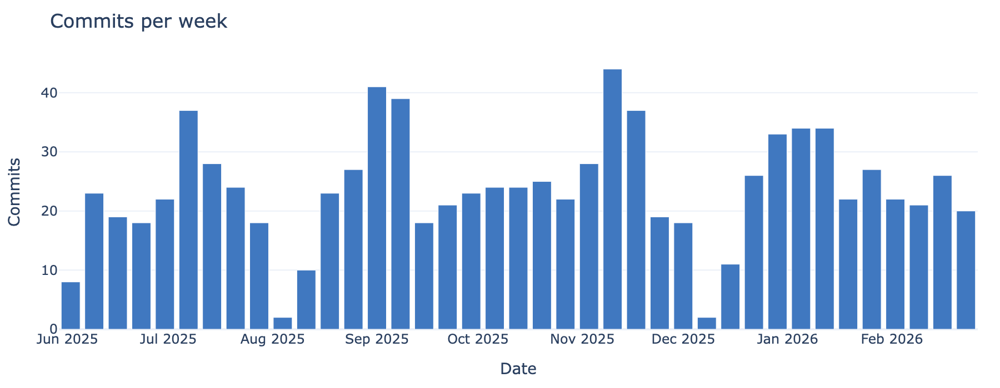
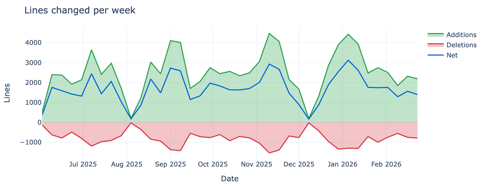

# gh-activity

Fetch your GitHub commit history and generate an interactive HTML report with charts and metrics. Everything runs locally — no data leaves your machine, nothing phones home, and the generated report works fully offline.

## Sample output





## Install

Requires Python 3.10+ and the [GitHub CLI](https://cli.github.com/) (`gh`), authenticated.

```bash
pip install -e .
```

## Usage

```bash
# Default: last 6 months of activity, auto granularity
gh-activity

# Custom date range
gh-activity --since 2025-06-01 --until 2026-02-23

# Monthly granularity, specific output file
gh-activity --granularity month --output report.html

# Force re-fetch (ignore cache)
gh-activity --refresh

# Explicit username and timezone
gh-activity --username octocat --timezone America/Los_Angeles

# Use Plotly CDN instead of embedding (smaller file, requires internet to view)
gh-activity --cdn
```

The report is written as a self-contained HTML file (default: `gh-activity-report.html`). Granularity auto-selects based on date range: day (<30 days), week (30–180 days), or month (>180 days).

## How it works

1. **Fetches commits** via the GitHub API using the `gh` CLI for authentication, searching by **author date** (when work was done, not when it was merged/rebased)
2. **Retrieves line stats** (additions/deletions) via GitHub's GraphQL API in batches
3. **Caches everything locally** in `~/.cache/gh-activity/` — repeated runs only fetch new data. Rate-limited API calls are retried automatically with exponential backoff. Once cached, no network access is needed to regenerate reports.
4. **Generates a self-contained HTML report** with all commit data embedded as JSON. All rendering happens client-side in the browser — no server, no analytics, no external requests (unless you opt into `--cdn` for a smaller file).

### Interactive controls

The report includes controls to adjust the view without re-fetching data:

- **Date range** — narrow or expand the time window
- **Granularity** — day, week, month, or auto
- **Repository** — filter to a single repo or view all (only repos with activity in the selected date range are shown)
- **Timezone** — display commit times in any IANA timezone

### Charts and metrics

- Summary metric cards with period-over-period deltas
- Contribution calendar heatmap
- Lines changed area chart (additions positive, deletions negative, net line)
- Commits bar chart with rolling average
- Day-of-week and hour-of-day distribution (side by side)
- Per-repository breakdown (filtered to date range)
- Active-day percentage by period
- Top commits by lines changed

## Privacy

All processing happens on your machine. The only network calls are to the GitHub API (via `gh`) to fetch your own commit data. The generated HTML file contains no tracking, no external scripts (unless `--cdn`), and no outbound requests. You can view it offline, share it as a file, or keep it private.

## Development

```bash
pip install -e .
python -m pytest tests/
```
